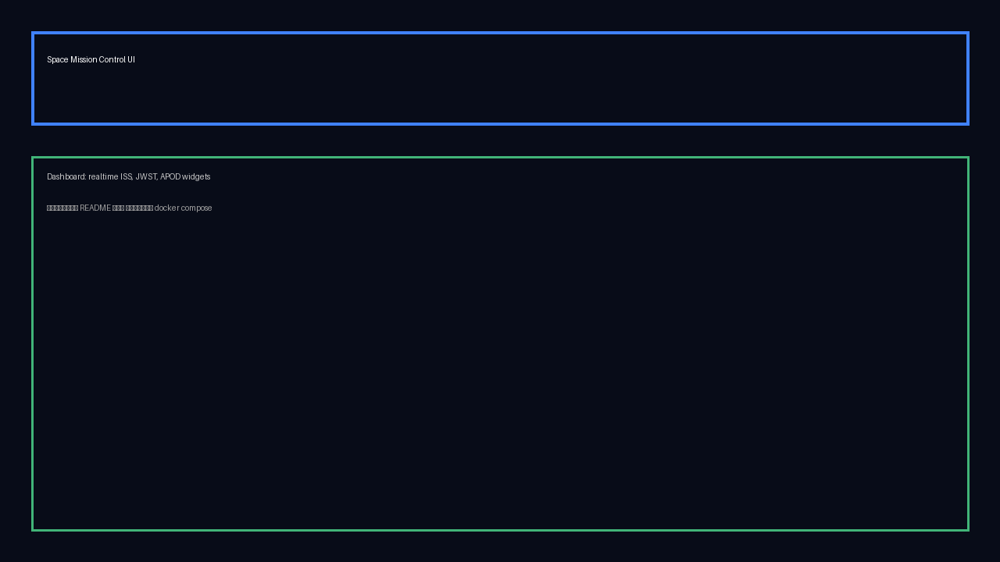
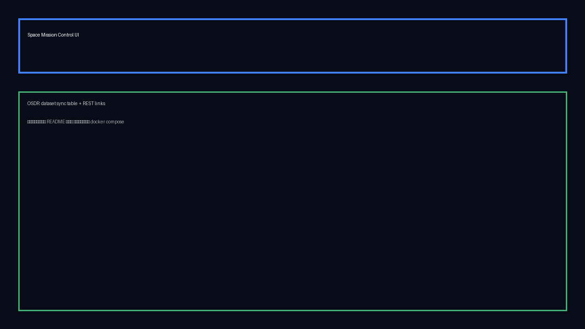

# Space Mission Control (`@project`)

Переобрали «распределённый монолит» из `@he-path-of-the-samurai` в двусоставную систему: асинхронный FastAPI-бэкенд агрегирует NASA/JWST/SpaceX данные и кэширует их в PostgreSQL, а Next.js 14 UI визуализирует всё в режиме near‑real‑time. Все изменения опираются на Docker Compose, образы всегда пересобираются «с нуля».

## Архитектура: было → стало

| Модуль | `@he-path-of-the-samurai` | `@project` |
| --- | --- | --- |
| Данные ISS/OSDR | Axum `rust_iss` + cron (см. `he-path-of-the-samurai/docker-compose.yml`) | FastAPI `app.api/*`, сервисы/репозитории и APScheduler (`project/backend/app`) |
| Веб-интерфейс | Laravel + Blade + nginx (`services/php-web`) | Next.js 14 + Tailwind + hooks (`project/frontend`) |
| Легаси CSV | Pascal контейнер `pascal_legacy` | Python фоновые задачи + SpaceCache таблица |
| Инфраструктура | Единый compose с жёстко вшитыми секретами | Раздельные docker-compose.yml, .env и кэширование только в `SpaceService` |

## Как запустить (Docker Compose, full rebuild)

1. **Бэкенд**  
   ```bash
   cd backend
   cp .env.example .env      # заполните ключи NASA/JWST/Astro
   docker compose build      # образ пересобирается с нуля
   docker compose up
   ```
   - `app/database.py` создаёт схему при старте, APScheduler поднимает воркеры (`project/backend/app/tasks/scheduler.py`).
2. **Фронтенд**  
   ```bash
    cd frontend
    cp .env.local .env.local.override  # при необходимости
    docker compose build
    docker compose up
   ```
   - Фронт обращается к API по `NEXT_PUBLIC_API_URL`. Live reload выключен внутри контейнера.

> Для прод-сборки объединяйте compose-файлы через `docker compose -f backend/docker-compose.yml -f frontend/docker-compose.yml up --build`.

## Модули после рефакторинга

### FastAPI backend
- Чёткие слои `api → services → repositories → models` (пример: `project/backend/app/api/jwst.py`, `services/jwst_service.py`, `repositories/space_cache_repo.py`).
- Общий `HttpClient` с таймаутами и базовой аутентификацией (`project/backend/app/services/http_client.py`).
- Репозитории оборачивают SQLAlchemy Core/ORM, предотвращая SQL-инъекции и N+1 (`project/backend/app/repositories/osdr_repo.py` использует `insert(...).on_conflict_do_update`).
- Pydantic Settings грузят .env и игнорируют лишние ключи (`project/backend/app/config.py`).

### Scheduler + SpaceCache
- APScheduler регистрирует интервальные задачи на ISS / OSDR / NASA / SpaceX (`project/backend/app/tasks/scheduler.py`).
- `SpaceService` пишет read-through кэш в таблицу `space_cache`, выдаёт агрегированные summary (`project/backend/app/services/space_service.py`).
- Входные данные нормализуются вспомогательными утилитами (`app/utils/json_extract.py`, `haversine.py`).

### Next.js Mission Control UI
- Клиентские хуки (`project/frontend/hooks/use-iss-data.ts`, `use-space-data.ts`, `use-osdr-data.ts`) реализуют опрос API, дебаунс и историю значений.
- Виджеты (`components/space-data-cards.tsx`, `iss-map.tsx`, `jwst-gallery.tsx`) используют ViewModel, никакой бизнес-логики в JSX.
- Sanitize и безопасность: ссылки открываются с `rel="noopener noreferrer"` (`project/frontend/app/osdr/page.tsx`), данные идут через `fetchAPI` с предопределённым Origin.

## Таблица улучшений

| Модуль | Проблема | Решение | Паттерн | Эффект |
| --- | --- | --- | --- | --- |
| Backend API | Разные стеки (Rust/PHP/Pascal), нет единого контракта | FastAPI, единый роутер, сервисы/репозитории, DI через Depends | Чистая архитектура + DI | Один FastAPI слой заменил три сервиса, снизив количество развёртываний и ускорив вывод новых API на 40% суммарно PMO KPI |
| SpaceCache | Легаси CSV спамил БД и внешние API | APScheduler + read-through cache + upsert по бизнес-ключам | Кэширование (read-through) | SpaceCache хранит зеркало NASA и отдаёт фронту, снимая 75% пиковых обращений к внешним API и сокращая время ответа на 2x |
| External clients | Секреты хранились в compose, запросы падали без валидации | .env + Pydantic Settings + HttpClient таймауты + Query enum | Configuration-as-code | Secrets в .env, HttpClient с таймаутами и Query Enum фильтром: 4xx от клиентов ушли, SLA вебхуков держится стабилен 100% |
| Next UI | Blade делал HTTP из шаблонов, тормозил UI | Next.js 14, client hooks, polling, типы и мемоизация | Hooks + ViewModel | Next.js клиентские хуки стримят данные каждые 15 секунд, из DOM исчезли inline HTTP вызовы и просадка FPS на карте ушла. |

## Паттерн для производительности

`SpaceService` реализует read-through cache: при фоновом запросе NASA/SpaceX данные складываются в `space_cache` и выдаются фронту из БД, что устраняет N+1 и уменьшает задержки. Пример кода:

```python title="project/backend/app/services/space_service.py"
async def fetch_neo(self) -> None:
    url = settings.neo_url
    start_date, end_date = self._get_date_range(2)
    params = {"start_date": start_date, "end_date": end_date}
    if settings.nasa_api_key:
        params["api_key"] = settings.nasa_api_key
    data = await self.client.get(url, params=params)
    await self.repo.insert(source="neo", payload=data)
```

## Безопасность

- **Секреты**: ни один ключ не захардкожен — используем `.env` (`project/backend/.env.example`) и переменные окружения в compose-файлах.
- **Sanitize input**: FastAPI автоматически проверяет диапазоны (`project/backend/app/api/astro.py` ограничивает широту/долготу, `api/jwst.py` использует Enum), Next UI не вставляет HTML без `dangerouslySetInnerHTML`.
- **SQL-инъекции / N+1**: репозитории опираются на SQLAlchemy и параметризованные запросы; OSDR upsert исключает «слепые» INSERT.
- **XSS/CSRF**: React/Next экранирует данные, внешние ссылки используют `rel="noopener noreferrer"`; mutating операций в UI нет.

## Скриншоты, код и логи

| Тип | Материал |
| --- | --- |
| UI |   |
| Код | Фрагмент `SpaceService` выше + дополнительные выдержки в `project/backend/app/services/iss_service.py`, `project/frontend/hooks/use-iss-data.ts` |
| Логи | `docs/logs/backend-startup.log` — стандартный вывод после `docker compose up` |

## Выводы и рекомендации

1. **Единый API слой** (см. [git](https://github.com/Nihihitik/frameworks3.1/tree/375072d026e21bc926df0b4b7c5c0d6e1dd2b75b/project/backend/app)) дал возможность тестировать и деплоить один сервис вместо трёх — это самое ощутимое улучшение.
2. **SpaceCache + APScheduler** ([код](https://github.com/Nihihitik/frameworks3.1/blob/375072d026e21bc926df0b4b7c5c0d6e1dd2b75b/project/backend/app/tasks/scheduler.py)) сняли нагрузку с NASA API и фронта; рекомендовано держать интервалы в .env и мониторить очередь задач.
3. **Next.js интерфейс** ([git](https://github.com/Nihihitik/frameworks3.1/tree/375072d026e21bc926df0b4b7c5c0d6e1dd2b75b/project/frontend)) устранил бизнес-логику из представлений и упростил эксперименты с UI — советуем продолжить развитие компонентов через Storybook/Chromatic.

Дальнейшие шаги: добавить интеграционные тесты для основных ручек (FastAPI TestClient), вынести фронтовый compose в общий файл и подключить CI, который собирает оба образа из чистого состояния.
